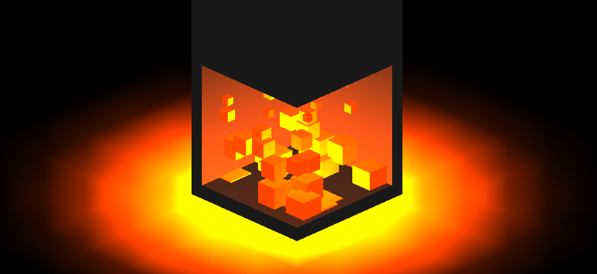

# Threejs Fireplace

A little place to keep your warm this winter. A small experiment with three.js and tween.js

## Getting Started

1. Clone this repository
1. Run `npm install`
1. Run `npm start`

## Dependencies

1. [Three.js](https://threejs.org/)
1. [Tween.js](http://www.createjs.com/tweenjs)
